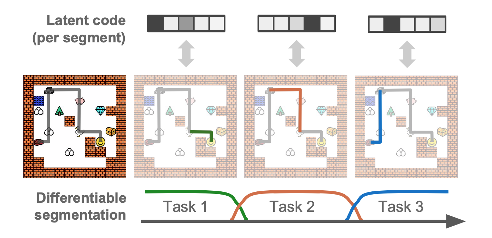

# CompILE implementation example

This is an example implementation of the CompILE model for a sequence segmentation toy task in PyTorch with minimal dependencies. Instead of operating on state-action trajectories (pairs of state and action sequences), this simplified version of the CompILE model operates on a single input sequence.



**CompILE: Compositional Imitation Learning and Execution (ICML 2019)**  
Thomas Kipf, Yujia Li, Hanjun Dai, Vinicius Zambaldi, Alvaro Sanchez-Gonzalez, Edward Grefenstette, Pushmeet Kohli, Peter Battaglia.
https://arxiv.org/abs/1812.01483

## Dependencies:
* Python 3.6 or later
* Numpy 1.14 or later
* PyTorch 0.4.1 or later

## Files:
* `train.py`: Entry point, run `python train.py` to train the model.
* `modules.py`: This file contains the CompILE model in a single PyTorch module.
* `utils.py`: This file contains utilities for the CompILE model and the toy data generator `generate_toy_data()`.

## Task:
We randomly generate sequences of the form `[NUM_1]*FREQ_1 + [NUM_2]*FREQ_2 + [NUM_3]*FREQ_3`, where `NUM_X` and `FREQ_X` are randomly drawn integers from a pre-defined range (with and without replacement, respectively). An example sequence looks as follows: `[4, 4, 5, 5, 5, 3, 3, 3]`. The CompILE model has to identify the correct segmentation (in this case: 3 segments) and encode each segment into a single latent variable, from which the respective segment will be reconstructed. The decoder is a two-layer MLP conditioned on the latent variable of the segment which outputs a single integer (as a categorical variable), which we repeat over the full sequence length to compute a loss.

## Running the model:
Run `python train.py` to train the model with default settings on CPU. Please inspect `train.py` and `modules.py` for model details and details on default settings.

During training, the script prints negative log likelihood (`nll_train`) and evaluation reconstruction accuracy (`rec_acc_eval`) after every training iteration. `rec_acc_eval` corresponds to the average (per time step) reconstruction accuracy for a mini-batch of generated samples, where the model runs in evaluation mode (concrete latent variables replaced with discrete ones, and Gaussian latents are replaced by their predicted mean). `rec_acc_eval` of `1.00` corresponds to perfect segmentation and reconstruction in this particular task.

This implementation uses a high learning rate of `1e-2` to reduce training time, which can however destabilize training in rare cases (for some random seeds). Please try reducing the learning rate to `1e-3` if you observe this effect. The default setting uses Gaussian latent variables (z) to encode segments. To train the model with concrete / Gumbel softmax latent variables, run `python train.py --latent-dist concrete`.

Example run (`python train.py`):

```
Training model...
Training model...
step: 0, nll_train: 16.967497, rec_acc_eval: 0.199
input sample: tensor([4, 4, 4, 5, 5, 5, 5, 2, 2, 2])
reconstruction: tensor([5, 5, 5, 5, 5, 5, 5, 5, 5, 5])
step: 5, nll_train: 13.127311, rec_acc_eval: 0.457
input sample: tensor([3, 2, 2, 2, 1])
reconstruction: tensor([5, 5, 5, 5, 1])
step: 10, nll_train: 9.720839, rec_acc_eval: 0.754
input sample: tensor([3, 3, 3, 3, 1, 2, 2, 2, 2])
reconstruction: tensor([3, 3, 3, 3, 3, 2, 2, 2, 2])
step: 15, nll_train: 7.894783, rec_acc_eval: 0.835
input sample: tensor([1, 1, 1, 4, 4, 4, 2, 2])
reconstruction: tensor([1, 1, 1, 4, 2, 2, 2, 2])
step: 20, nll_train: 4.874952, rec_acc_eval: 0.954
input sample: tensor([3, 3, 5, 5, 1, 1])
reconstruction: tensor([3, 3, 5, 5, 1, 1])
step: 25, nll_train: 1.253607, rec_acc_eval: 0.997
input sample: tensor([5, 4, 4, 4, 3, 3])
reconstruction: tensor([5, 4, 4, 4, 3, 3])
step: 30, nll_train: 0.547728, rec_acc_eval: 1.000
input sample: tensor([1, 1, 1, 4, 4, 4, 4, 3, 3])
reconstruction: tensor([1, 1, 1, 4, 4, 4, 4, 3, 3])
```

### Cite
If you make use of this code in your own work, please cite our paper:
```
@inproceedings{kipf2019compositional,
  title={CompILE: Compositional Imitation Learning and Execution},
  author={Kipf, Thomas and Li, Yujia and Dai, Hanjun and Zambaldi, Vinicius and Sanchez-Gonzalez, Alvaro and Grefenstette, Edward and Kohli, Pushmeet and Battaglia, Peter},
  booktitle={International Conference on Machine Learning (ICML)},
  year={2019}
}
```
